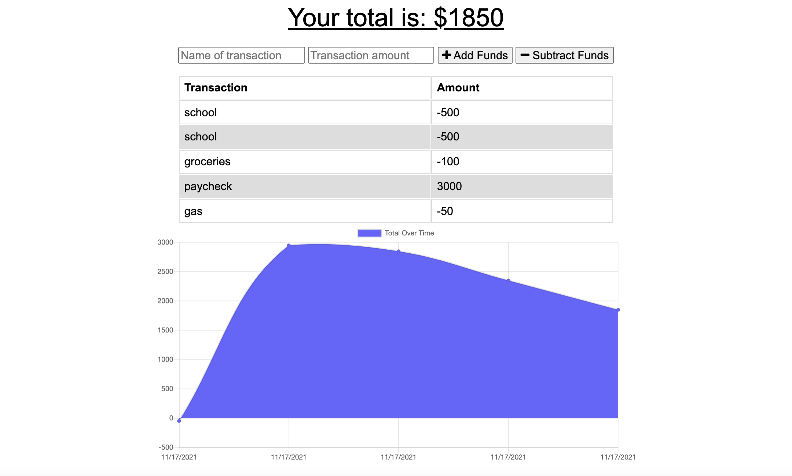

# Progressive Budget Tracker

  

  ## Description
 This application allows users to keep track of their budget by adding in transactions. The expenses and deposits can be added with or without an internet connection. Transactions added while the app is offline will persist once the application is brought back online.

 ## Mock Up

 

 ## Heroku Application

 [Click to view the deployed application](https://ltf-budget-tracker.herokuapp.com/)

  ## Table of Contents 
  * [Installation](#installation)
  * [Usage](#usage)
  * [Questions](#questions)
  * [License](#license)
  
  ## Installation

  *Follow these steps to properly install this application:*

  There is no need to install anything to use this application.

  ## Usage

  **How to use this application:**

  Enter a transaction name and amount into the boxes. You can then select to add or subtract the funds based on if the input is a deposit or an expense. The application will track spending based on input transactions.

  ## License

  This repository has the MIT license. 
    For additional information, please view the [license description](https://opensource.org/licenses/MIT)
      

  ## Questions

  *For any additional questions or feedback about this application:*

  Feel free to reach out via email or contact me on Github:

  Email:
  [lindsaytfitz@gmail.com](mailto:lindsaytfitz@gmail.com)

  Github:
  [lindsfitz](https://github.com/lindsfitz)